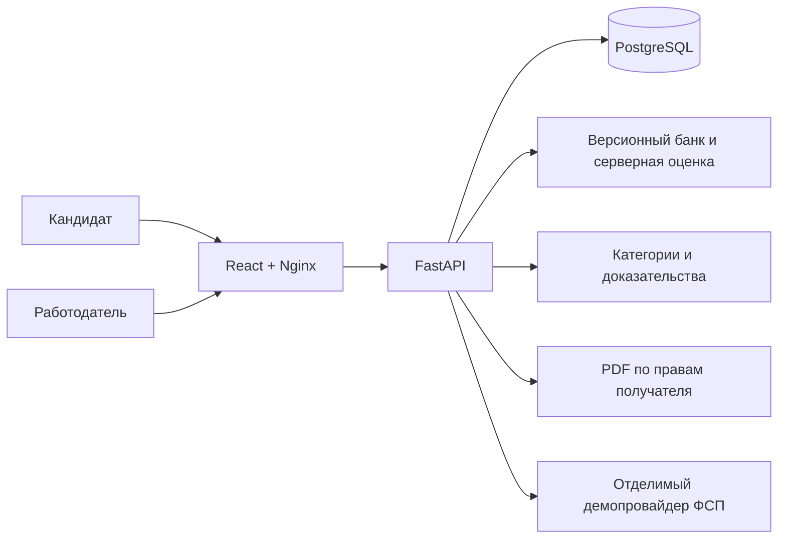

# Архитектура MVP 1.0.0

Один React/TypeScript frontend, один FastAPI backend и одна PostgreSQL 16.
Nginx раздаёт статические файлы и проксирует `/api`. GPU, платные модели,
внешние вакансии и сторонний архив для запуска не нужны.

`apps/api/fsp/models.py` содержит 14 таблиц. Пользователь отделён от компании
через CompanyMember. В MVP один пользователь принадлежит одной компании;
управление сотрудниками через UI отложено. Категории, грейды, навыки и семейства
задач — версионные справочники `bank.py`, без отдельного CRUD администратора.

User хранит роль, хеш пароля и подтверждение e-mail. Session и Verification
хранят только SHA-256 непрозрачных случайных токенов и срок действия.
Profile разделяет claimed_grade и verified_grade, хранит ссылку на успешную
попытку, настройки видимости, самодекларацию и достижения. Attempt хранит
seed, версию, задания, эталоны, ответы и результат; SkillEvidence связывает
конкретный навык с попыткой, долей верных ответов и датой. Result находится
в JSON попытки, отдельно продублированы структурированные доказательства.

Need хранит подтверждённые структурированные требования. Snapshot хранит
порядок кандидатов, методику, основания и обезличенные доказательства на дату
поиска. При чтении снимка повторно проверяются публикация, скрытие стажа
и адресное право на контакты; имя и контакты не кэшируются в снимке.
Грейд/доказательства в снимке исторические, актуальный PDF строится по текущему
профилю. Редактирование запроса создаёт новый снимок, старый не перезаписывается.

Invitation содержит условия, компанию и контакт работодателя на момент
отправки. ContactGrant — отдельная запись `(candidate_id, company_id)`.
Принятие и выдача права происходят в одной транзакции. Message принадлежит
приглашению. Consent хранит историю согласий с версией текста и датой.

## Подбор

Сначала точная специализация и один из выбранных подтверждённых грейдов;
неподтверждённый профиль есть только в отдельной группе банка. Затем внутри
каждой категории применяется matching-1.0.0:

`60 × доля met среди обязательных + 15 × доля met среди желательных
+ 0,2 × результат успешного теста + бонус ФСП (0…5)`.

Пустой список требований даёт нулевую часть, без неявного перераспределения
весов. Индекс — не вероятность и не процент пригодности. Достижения
демопровайдера дают 1/2/3 балла, общий вклад ограничен 5. Текст, ФИО,
контакты, пол, возраст не участвуют. Сортировка между грейдами лишь группирует
карточки; высокий спортивный бонус не переводит человека в другую категорию.

`met` — есть положительное доказательство выбранного успешного теста;
`unmet` — критерий проверен, порог навыка не достигнут; `unknown` — проверки
нет. Даже числовой стаж остаётся самодекларацией, поэтому требование стажа
получает unknown и не добавляет баллы. Ноль лет и неизвестный стаж различаются.

Описание потребности сохраняется для контекста. Пользователь сам задаёт
структуру и подтверждает её; автоматического NLP-разбора нет. Обязательный
навык — критерий оценки, а не жёсткое исключение: слабые совпадения остаются
видимыми с unknown/unmet. Контрольный запрос React в оценке показывает
ограничение этого подхода. В дальнейшем можно добавить явный режим
«только все обязательные навыки подтверждены».

## Транзакции и безопасность

Блокировка строки Profile сериализует старт/сдачу тестов, принятие приглашения
и отзыв согласия. Company блокируется при создании приглашений; ключ запроса
уникален внутри компании. Повтор одного payload возвращает ту же запись,
изменение payload с тем же ключом даёт 409. Принятое/отклонённое решение
терминально; повтор того же статуса безопасен, противоположное решение — 409.

Транзакция БД завершается до отправки ответа: `Depends(..., scope="function")`.
Это исключает ответ об успешном создании сессии до фиксации записи.
Семантика scope сверена с [документацией FastAPI](https://fastapi.tiangolo.com/tutorial/dependencies/dependencies-with-yield/#early-exit-and-scope).

Доступ проверяется в API по роли, владельцу и компании. Один и тот же
`projection()` используется для выдачи и PDF. До согласия скрыт весь
произвольный текст кандидата, включая контакты в ФИО/описании/ролях.
PDF создаётся для текущего получателя, в памяти, без публичного файла.
Ответы API имеют `Cache-Control: no-store`. React экранирует текст, PDF
экранирует XML. Произвольный код кандидата не исполняется.

Отзыв публикации/обработки удаляет ContactGrant. Исторические приглашения
остаются у сторон, но без контактов; диалог закрывается. Повторное включение
публикации и повтор запроса принятия старого приглашения право не возвращают.
Нужно новое приглашение и новое принятие. Уже скачанный третьей стороной PDF
технически отозвать невозможно.

Пароли — Argon2id. Cookie — HttpOnly, SameSite=Lax, 24 часа; Secure включается
для HTTPS через окружение. Подтверждение почты — один час, один раз.
Изменяющие запросы требуют `X-Requested-With: fsp-web`; CORS не включён,
nginx ограничивает тело 64 KiB. Auth имеет ограничение 20 запросов в минуту
на адрес процесса; это простой локальный limiter, не распределённый сервис.
